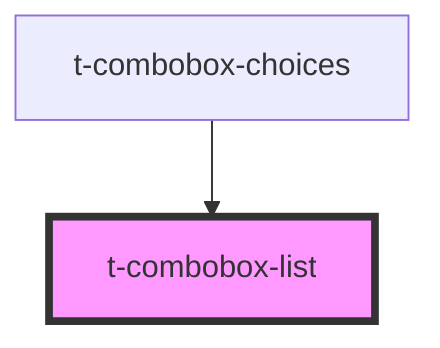

# t-combobox-list

<!-- Auto Generated Below -->

## Properties

| Property   | Attribute | Description | Type                 | Default     |
| ---------- | --------- | ----------- | -------------------- | ----------- |
| `messages` | --        |             | `IComboboxMessages`  | `undefined` |
| `options`  | --        |             | `IComboboxOption[]`  | `[]`        |
| `target`   | --        |             | `HTMLElement`        | `undefined` |
| `value`    | `value`   |             | `string \| string[]` | `undefined` |

## Events

| Event    | Description | Type               |
| -------- | ----------- | ------------------ |
| `select` |             | `CustomEvent<any>` |

## Methods

### `focusFirst() => Promise<void>`

#### Returns

Type: `Promise<void>`

### `focusNext() => Promise<void>`

#### Returns

Type: `Promise<void>`

### `focusPrevious() => Promise<void>`

#### Returns

Type: `Promise<void>`

### `hasFocusedOption() => Promise<boolean>`

#### Returns

Type: `Promise<boolean>`

### `selectFocused() => Promise<void>`

#### Returns

Type: `Promise<void>`

### `updatePosition() => Promise<void>`

#### Returns

Type: `Promise<void>`

## Dependencies

### Used by

 - [t-combobox-choices](.)

### Graph

----------------------------------------------

*Built with [StencilJS](https://stenciljs.com/)*
