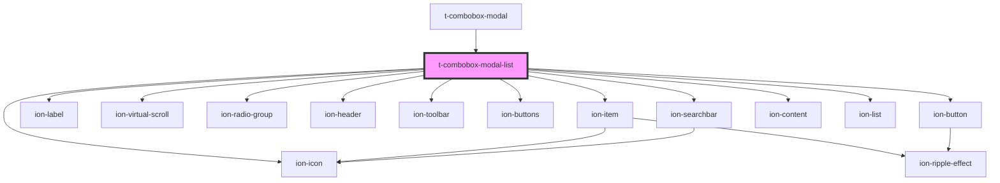

# t-combobox-modal-list

<!-- Auto Generated Below -->

## Properties

| Property   | Attribute  | Description | Type                 | Default     |
| ---------- | ---------- | ----------- | -------------------- | ----------- |
| `debounce` | `debounce` |             | `number`             | `undefined` |
| `messages` | --         |             | `IComboboxMessages`  | `undefined` |
| `multiple` | `multiple` |             | `boolean`            | `false`     |
| `options`  | --         |             | `NormalizedOption[]` | `[]`        |
| `value`    | `value`    |             | `string \| string[]` | `undefined` |

## Events

| Event    | Description | Type               |
| -------- | ----------- | ------------------ |
| `select` |             | `CustomEvent<any>` |

## Methods

### `close() => Promise<any>`

#### Returns

Type: `Promise<any>`

## Dependencies

### Used by

 - [t-combobox-modal](../t-combobox-modal)

### Depends on

- ion-item
- ion-label
- ion-virtual-scroll
- ion-radio-group
- ion-header
- ion-toolbar
- ion-buttons
- ion-button
- ion-icon
- ion-searchbar
- ion-content
- ion-list

### Graph

----------------------------------------------

*Built with [StencilJS](https://stenciljs.com/)*
