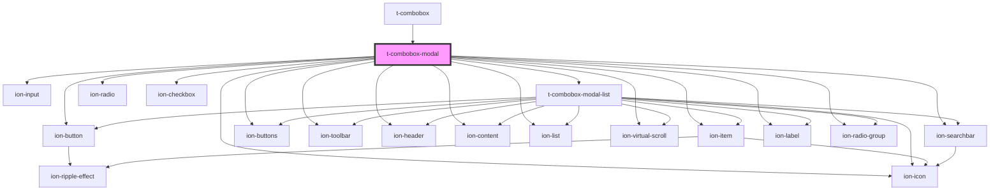

# t-combobox-modal

<!-- Auto Generated Below -->

## Properties

| Property      | Attribute     | Description | Type                | Default                                 |
| ------------- | ------------- | ----------- | ------------------- | --------------------------------------- |
| `autofocus`   | `autofocus`   |             | `boolean`           | `undefined`                             |
| `debounce`    | `debounce`    |             | `number`            | `ComboboxDefaultOptions.searchDebounce` |
| `disabled`    | `disabled`    |             | `boolean`           | `undefined`                             |
| `messages`    | --            |             | `IComboboxMessages` | `undefined`                             |
| `multiple`    | `multiple`    |             | `boolean`           | `undefined`                             |
| `name`        | `name`        |             | `string`            | `undefined`                             |
| `options`     | --            |             | `IComboboxOption[]` | `undefined`                             |
| `placeholder` | `placeholder` |             | `string`            | `undefined`                             |
| `readonly`    | `readonly`    |             | `boolean`           | `undefined`                             |
| `required`    | `required`    |             | `boolean`           | `undefined`                             |
| `value`       | `value`       |             | `any`               | `undefined`                             |

## Events

| Event      | Description | Type               |
| ---------- | ----------- | ------------------ |
| `change`   |             | `CustomEvent<any>` |
| `ionStyle` |             | `CustomEvent<any>` |

## Dependencies

### Used by

 - [t-combobox](../t-combobox)

### Depends on

- ion-input
- ion-button
- ion-icon
- [t-combobox-modal-list](../t-combobox-modal-list)
- ion-searchbar
- ion-buttons
- ion-toolbar
- ion-header
- ion-content
- ion-list
- ion-virtual-scroll
- ion-item
- ion-label
- ion-radio
- ion-checkbox
- ion-radio-group

### Graph

----------------------------------------------

*Built with [StencilJS](https://stenciljs.com/)*
