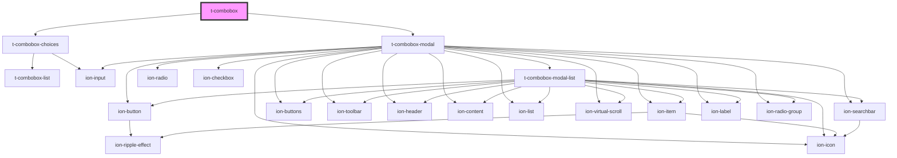

# t-combobox

<!-- Auto Generated Below -->

## Properties

| Property         | Attribute         | Description                                                                                                                                                 | Type                                                                                     | Default                                 |
| ---------------- | ----------------- | ----------------------------------------------------------------------------------------------------------------------------------------------------------- | ---------------------------------------------------------------------------------------- | --------------------------------------- |
| `autofocus`      | `autofocus`       | Set the focus on component is loaded.                                                                                                                       | `boolean`                                                                                | `false`                                 |
| `disabled`       | `disabled`        | If `true`, the user cannot interact with the input. Defaults to `false`.                                                                                    | `boolean`                                                                                | `false`                                 |
| `messages`       | --                | The messages that will be shown                                                                                                                             | `IComboboxMessages`                                                                      | `undefined`                             |
| `multiple`       | `multiple`        | If `true`, the user can enter more than one value. This attribute applies when the type attribute is set to `"email"` or `"file"`, otherwise it is ignored. | `boolean`                                                                                | `false`                                 |
| `name`           | `name`            | Native select name attribute                                                                                                                                | `string`                                                                                 | `undefined`                             |
| `optionDetail`   | `option-detail`   |                                                                                                                                                             | `string`                                                                                 | `undefined`                             |
| `optionText`     | `option-text`     |                                                                                                                                                             | `string`                                                                                 | `undefined`                             |
| `optionValue`    | `option-value`    |                                                                                                                                                             | `string`                                                                                 | `undefined`                             |
| `options`        | --                | The visible options to select.                                                                                                                              | `IComboboxOption[] \| any[]`                                                             | `undefined`                             |
| `placeholder`    | `placeholder`     | Set the input's placeholder when no option is selected.                                                                                                     | `string`                                                                                 | `undefined`                             |
| `readonly`       | `readonly`        | If `true`, the user cannot interact with the input. Defaults to `false`.                                                                                    | `boolean`                                                                                | `false`                                 |
| `required`       | `required`        | If `true`, the user must fill in a value before submitting a form.                                                                                          | `boolean`                                                                                | `false`                                 |
| `search`         | --                | Override the default search behavior. Useful to send the search to a web server.                                                                            | `(options?: { searchText: string; }) => IComboboxOption[] \| Promise<IComboboxOption[]>` | `undefined`                             |
| `searchDebounce` | `search-debounce` | Set the amount of time, in milliseconds, to wait to trigger the search after each keystroke. Default `250`.                                                 | `number`                                                                                 | `ComboboxDefaultOptions.searchDebounce` |
| `value`          | `value`           | The value of the input.                                                                                                                                     | `any`                                                                                    | `undefined`                             |

## Events

| Event    | Description                                 | Type               |
| -------- | ------------------------------------------- | ------------------ |
| `change` | Trigger change event when value has changed | `CustomEvent<any>` |

## Dependencies

### Depends on

- [t-combobox-choices](../t-combobox-choices)
- [t-combobox-modal](../t-combobox-modal)

### Graph

----------------------------------------------

*Built with [StencilJS](https://stenciljs.com/)*
