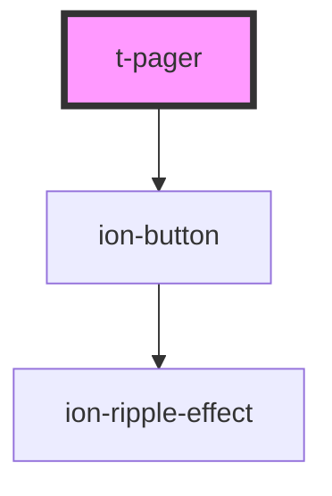

# t-pager

<!-- Auto Generated Below -->

## Properties

| Property     | Attribute     | Description | Type            | Default     |
| ------------ | ------------- | ----------- | --------------- | ----------- |
| `disabled`   | `disabled`    |             | `boolean`       | `false`     |
| `messages`   | --            |             | `PagerMessages` | `undefined` |
| `page`       | `page`        |             | `number`        | `1`         |
| `pageSize`   | `page-size`   |             | `number`        | `20`        |
| `totalItems` | `total-items` |             | `number`        | `500`       |

## Events

| Event         | Description | Type                       |
| ------------- | ----------- | -------------------------- |
| `pageChanged` |             | `CustomEvent<PageChanged>` |

## Dependencies

### Depends on

- ion-button

### Graph

----------------------------------------------

*Built with [StencilJS](https://stenciljs.com/)*
