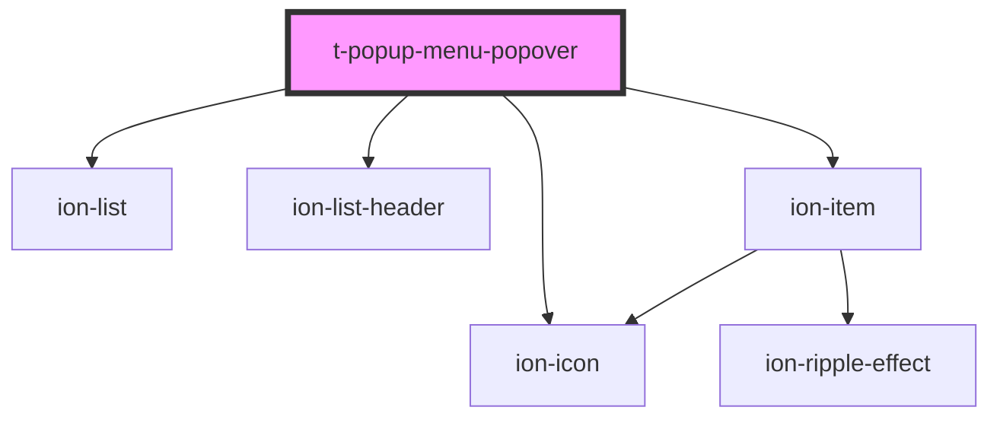

# t-popup-menu-popover

<!-- Auto Generated Below -->

## Properties

| Property  | Attribute | Description | Type                | Default     |
| --------- | --------- | ----------- | ------------------- | ----------- |
| `buttons` | --        |             | `PopupMenuButton[]` | `undefined` |
| `header`  | `header`  |             | `string`            | `undefined` |

## Methods

### `dismiss() => Promise<void>`

#### Returns

Type: `Promise<void>`

## Dependencies

### Depends on

- ion-list
- ion-list-header
- ion-item
- ion-icon

### Graph

----------------------------------------------

*Built with [StencilJS](https://stenciljs.com/)*
