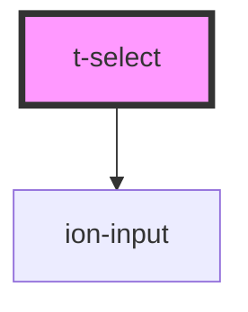

# t-select

<!-- Auto Generated Below -->

## Properties

| Property    | Attribute   | Description | Type                 | Default     |
| ----------- | ----------- | ----------- | -------------------- | ----------- |
| `autofocus` | `autofocus` |             | `boolean`            | `false`     |
| `disabled`  | `disabled`  |             | `boolean`            | `false`     |
| `hidden`    | `hidden`    |             | `boolean`            | `false`     |
| `multiple`  | `multiple`  |             | `boolean`            | `false`     |
| `name`      | `name`      |             | `string`             | `undefined` |
| `readonly`  | `readonly`  |             | `boolean`            | `false`     |
| `required`  | `required`  |             | `boolean`            | `false`     |
| `value`     | `value`     |             | `string \| string[]` | `undefined` |

## Events

| Event      | Description | Type               |
| ---------- | ----------- | ------------------ |
| `ionStyle` |             | `CustomEvent<any>` |

## Dependencies

### Depends on

- ion-input

### Graph

----------------------------------------------

*Built with [StencilJS](https://stenciljs.com/)*
